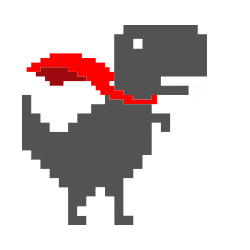

# Hi there, I'm AbyyIenzz! 👋 

<!-- Teks mengetik otomatis -->
<p align="left">
  <a href="https://github.com/denvercoder1/readme-typing-svg"></a>
</p>

Welcome to my profile! I am a Software Engineering student currently diving deep into web development, UI/UX prototyping, and cybersecurity. I love exploring code structures, building responsive interfaces, and practicing my skills through CTF challenges.

---

### 🌐 Language


---

### 🛠️ Tools


---

### 🤝 Let's Connect!

[](https://linkedin.com/in/abyyienzz-jayden-a7b6743b1)
[](mailto:belom-ada@gmail.com)

---

### ⚡ Fun Fact

```python
class Developer:
    def __init__(self):
        self.name = "AbyyIenzz"
        self.role = "Student"
        self.interests = ["Web Dev", "UI/UX Design", "CTF"]
